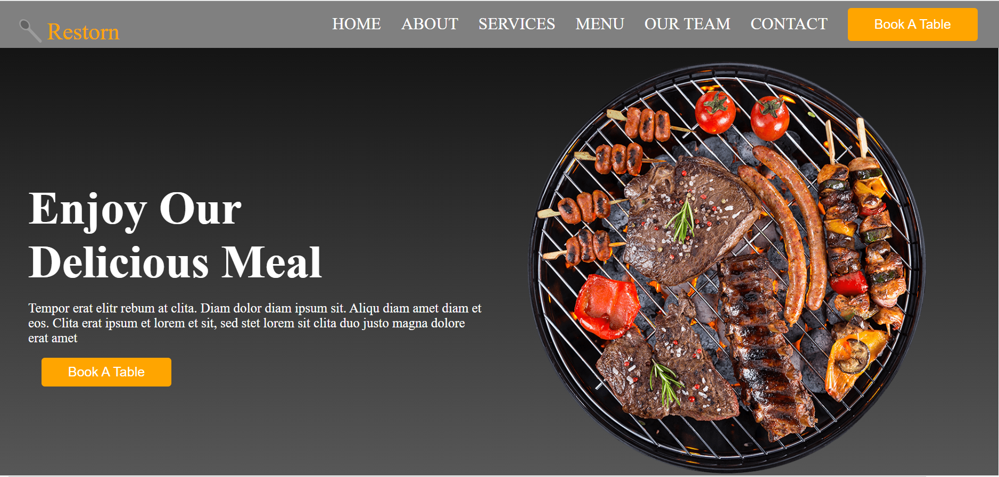

# WELCOME TO RESTORN WEBSITE
A restaurant is a business formation which prepares and serves food and drink to customers in return for money, either paid before the meal, after the meal, or with a running tab. Meals are generally served and eaten on premises.
# MENUS
* CHIKEN BURGUER
* PIZZA
* SANDWICH
* COLD DRINKS
# IMAGES

 
 ### vist our website 🤗🤗

